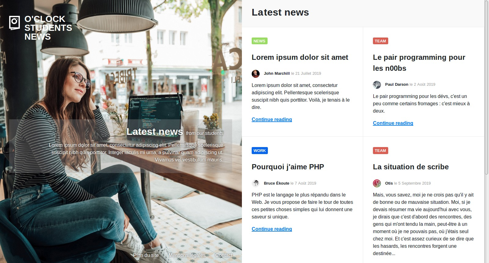

# oNews

O'Clock sort son journal d'étudiants :muscle:

Votre mission, si vous l'acceptez (...pfff évidemment qu'on l'accepte ), sera d'intégrer la maquette du site.

## Infos / marche à suivre

- la maquette à intégrer est [ici](home.jpg)

### Astuces

- Avant de commencer à coder, il faut toujours prendre un peu de recul et analyser la maquette et les éléments qui la compose :
  - Est-ce que tout va être dans le même container, ou est ce qu'on va vouloir découper en blocs, de plus en plus précis ?
  - Est-ce qu'il n'y aurait pas deux blocs qui se dégagent de manière évidente ?
- Une bonne habitude à avoir est de travailler par couche :
  - Couche 1 : les grosses parties de la page ( HTML **puis** CSS)
  - Couche 2 : La partie gauche ( HTML **puis** CSS)
  - Couche 3 : La partie droite ( HTML **puis** CSS)
- Les articles devraient peut-être avoir leur propre élément, non ? Si seulement il existait un élément HTML qui correspond sémantiquement...

  
Si vous avez besoin d'une marche à suivre plus précise 

  - Commencer par découper la page en deux blocs, celui de gauche avec l'image, le titre et le logo et celui de droite avec les articles
    - Chacun de ces éléments fait 50% de la page, mais on ne s'embête pas avec le [responsive](https://developer.mozilla.org/fr/docs/Learn/CSS/CSS_layout/Responsive_Design) :p
  - L'image serait sans doute bien dans le background de notre moitié gauche, non ?
  - Pour le bloc latest news de gauche, il va falloir le centrer verticalement dans la page. Possible que les flexbox soient utiles.
  - Pour le bloc de droite : 
    - Chacun des blocs de texte pourrait être un élément `<article>`. C'est un container et en plus c'est sémantiquement exact \o/ !
    - Réalise à fond un article, les autres ont une mise en forme quasiment identique.
    - Pour en avoir exactement deux sur une ligne, il va encore falloir se pencher sur des flexbox et peut-être même sur du wrap ( non, pas le sandwich... ).
  

## Charte

### Visuels

Le dossier [images](./images/) contient tous les visuels nécessaires pour cette intégration.

_Ne vous préoccupez pas pour l'instant du contraste des textes sur l'image :wink: Ça fera l'objet d'un bonus_ :skull:

### Couleurs

- Fond header :  `#f9f9f9`
- Bordure d'article :  `#eaeaea`
- WORK :  `#0766F0`
- TEAM :  `#DC5E53`
- NEWS :  `#98DC62`

### Font

Choix libre mais de type sans-serif
Rappel pour intégrer une police en CSS ([https://developer.mozilla.org/fr/docs/Web/CSS/@font-face](https://developer.mozilla.org/fr/docs/Web/CSS/@font-face))

- [Velvetyne](https://velvetyne.fr/)
- [open-foundry](https://open-foundry.com/fonts)

## Informations additionnelles

- Les deux parties (portrait et grille d'articles) sont sur une seule et même page
- L'image de la partie de gauche touche les bords supérieur, inférieur et gauche du navigateur, mais n'aura pas la même apparence selon la largeur de chaque écran. Tant qu'elle touche les bords, n'est pas déformée et prend la moitié de la page, c'est que c'est bon ; même si elle se retrouve un peu rognée verticalement.
- N'oubliez pas de mettre un effet lors du survol des liens par la souris :wink:
- Un fichier _SVG_ est une image vectorielle, voir [MDN sur SVG](https://developer.mozilla.org/fr/docs/Web/SVG)
- Si possible, placer le logo SVG en background :wink:
- Ne vous souciez pas des liens, vous pouvez mettre un petit # dans le HREF
- Il y a une scrollbar à droite, mais on en tient pas compte
- La librairie `reboot.css` est déjà incluse dans le fichier HTML pour standardiser les styles par défaut des balises HTML. Pour constater visuellement les differences avec et sans reboot : 
  1. Allez sur [https://codepen.io/ncerminara/pen/RLMwmy](https://codepen.io/ncerminara/pen/RLMwmy)
  1. Changez de sélection dans le menu déroulant _None (Browser styles only)_
  1. Vous verrez les différences en 1 clin d'œil :wink:

- Vous aurez besoin de spécifier une couleur avec de la transparence => `rgba(0, 0, 255, 0.5)` par exemple pour du bleu à 50% d'opacité => https://cssreference.io/property/color/
- Vous aurez peut-être besoin de dire à un élément de prendre 100% de la hauteur de la fenêtre => `height: 100vh;`
  - pour comprendre l'unité `vh`, [la doc sur les unités de mesures sur MDN](https://developer.mozilla.org/en-US/docs/Web/CSS/length)

## Git

- Il ne faut pas oublier d'enregistrer ses modifications (versions) avec **git**
- Il est préférable de le faire à chaque fonctionnalité terminée (par exemple, une fois la partie de gauche terminée => sauvegarde)
- Rappel des commandes **git** :
  - Fiche récap : https://kourou.oclock.io/ressources/fiche-recap/git-et-github/#gestion-des-fichiers
  - Schéma étapes : https://kourou.oclock.io/content/uploads/2020/09/premiers-pas.png
  - `git add .` pour ajouter tous les fichiers ajoutés/modifiés au prochain commit
  - `git commit -m "message explicite expliquant les modifs effectuées"` pour sauvegarder la version actuelle des fichiers sources

## Bonus "lisibilité" :white_flower:

Si vous avez lu tout l'énoncé, vous savez ce qu'il vous reste à faire ;-)
- Trouvez les propriétés et valeurs CSS idéales pour que le cadre transparent derrière le texte central bouge harmonieusement lorsque vous modifiez la taille de la fenêtre
- Identifiez un moyen de faire ressortir les liens en bas de la page sur le fond clair

## Bonus "défilement" :skull:

- Il y a une scrollbar à droite, et désormais on en tient compte :boom:
- La page contient en tout 6 articles, même si seuls 4 sont visibles
- Lorsqu'on fait défiler la page pour voir les 2 articles suivants :
  - La partie de gauche ne bouge pas, elle reste figée
  - Le scroll fait descendre la partie droite et affiche les 2 articles suivants
